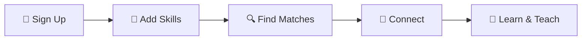

# 🔄 ByteSwap

### **Peer-to-Peer Skill Exchange Platform**

**🌐 WebApp Link:** [https://byteswap-app.onrender.com](https://byteswap-app.onrender.com)

***


*Connect. Learn. Teach. Grow.* 🚀

## 🎯 What is ByteSwap?

ByteSwap bridges the gap between learners and experts through **anonymous skill exchange sessions**. Whether you're looking to master React, dive into Machine Learning, or explore new technologies, ByteSwap connects you with peers who share complementary skills.

> **💡 The Concept:** You teach what you know, learn what you need.

***

## ✨ Key Features

| 🔐 **Secure Auth** | 🎯 **Smart Matching** | 💬 **Real-time Chat** | 👥 **Anonymous Sessions** |
|:---:|:---:|:---:|:---:|
| JWT-based authentication | Algorithm matches complementary skills | Socket.IO powered messaging | Privacy-focused interactions |

## ✨ Features

- **User Authentication** - Secure JWT-based registration and login
- **Smart Matching System** - Algorithm matches users based on complementary skills
- **Real-time Chat** - Anonymous chat sessions with Socket.IO
- **Skill Management** - Users can specify multiple skills to teach/learn
- **Session Management** - Timed chat sessions with automatic cleanup
- **Responsive Design** - Mobile-friendly interface with Tailwind CSS
- **Privacy-First** - Anonymous usernames during chat sessions

## 🛠️ Tech Stack

**Frontend:**

- React 18 with Vite
- React Router v6 for routing
- Tailwind CSS for styling
- Axios for API calls
- Socket.IO Client for real-time communication

**Backend:**

- Node.js with Express.js
- MongoDB with Mongoose ODM
- Socket.IO for real-time features
- JWT for authentication
- bcryptjs for password hashing

**Deployment:**

- Frontend: Render Static Sites
- Backend: Render Web Services
- Database: MongoDB Atlas

***

## 📁 Project Structure

```
ByteSwap/
├── byteswap-backend/          # Express API server
│   ├── 🔒 middleware/            # Auth and validation middleware
│   ├── 🗄️ models/               # Mongoose schemas
│   ├── 🛤️ routes/               # API route handlers
│   ├── 🔧 utils/                # Helper utilities
│   └── 🚀 server.js            # Main server file
├── byteswap-frontend/        # React client application
│   ├── 📄 public/              # Static assets
│   ├── ⚛️ src/
│   │   ├── 🧩 Components/      # Reusable React components
│   │   ├── 📑 Pages/          # Page components
│   │   ├── 🌐 Contexts/       # React context providers
│   │   ├── 🔌 Services/       # API service functions
│   │   └── ⚙️ Constants/      # App constants and config
│   └── ⚡ vite.config.js      # Vite configuration
```


***

## 🚀 Getting Started

### Prerequisites

- Node.js (v16 or higher)
- npm or yarn
- MongoDB Atlas account
- Git


### Local Development Setup

#### Backend Setup

1. **Clone the repository**

```bash
git clone https://github.com/Phani943/ByteSwap.git
cd ByteSwap/byteswap-backend
```

2. **Install dependencies**

```bash
npm install
```

3. **Environment Configuration**

Create a `.env` file in the backend directory:

```env
MONGODB_URI=your_mongodb_connection_string
JWT_SECRET=your_super_secret_jwt_key
PORT=5000
CLIENT_URL=http://localhost:5173
NODE_ENV=development
```

4. **Start the backend server**

```bash
npm run dev
```


#### Frontend Setup

1. **Navigate to frontend directory**

```bash
cd ../byteswap-frontend
```

2. **Install dependencies**

```bash
npm install
```

3. **Start the development server**

```bash
npm run dev
```


The application will be available at `http://localhost:5173`

***

## 🌐 Deployment

### **🔥 Deploy on Render**

#### **🖥️ Backend Deployment**

1. **Create Web Service** on [Render](https://render.com)
2. **Connect Repository** - Link your GitHub repo
3. **Environment Variables:**

```env
MONGODB_URI=your_production_mongodb_uri
JWT_SECRET=your_secure_jwt_secret
CLIENT_URL=https://your-frontend-url.onrender.com
NODE_ENV=production
```

4. **Deploy** with default settings ✅

#### **💻 Frontend Deployment**

1. **Create Static Site** on Render
2. **Build Settings:**
    - Build Command: `npm install && npm run build`
    - Publish Directory: `dist`
3. **Environment Variables:**

```env
VITE_API_URL=https://your-backend-url.onrender.com
```

4. **Add SPA Redirect Rule:**
    - Source: `/*`
    - Destination: `/index.html`
    - Type: `Rewrite`

***

## 🎮 How to Use ByteSwap

#### **🌟 Get Started in 5 Steps**


1. **📝 Create Account** - Secure registration with email verification
2. **🎯 Define Skills** - Specify what you teach and want to learn
3. **🔍 Discover Matches** - AI-powered matching based on skill compatibility
4. **🤝 Connect** - Send connection requests to potential learning partners
5. **💬 Start Learning** - Engage in anonymous, timed knowledge exchange sessions

***

## 🤝 Contributing

I welcome contributions from the community! Here's how you can help make ByteSwap better:

### **🚀 Development Workflow**

```bash
# Fork the repository
git clone https://github.com/your-username/ByteSwap.git

# Create feature branch
git checkout -b feature/amazing-feature

# Make changes and commit
git commit -m "✨ Add amazing feature"

# Push to branch
git push origin feature/amazing-feature

# Open Pull Request 🎉
```


***

## 📄 License

**This project is licensed under the MIT License**

***

## 👨‍💻 About the Developer

**Phani**  
*Ai Engineer & Full Stack Developer & Open Source Enthusiast*

***

## 🌟 Show Your Support

If ByteSwap helped you learn something new or inspired your next project consider giving it a ⭐!

**Made with ❤️ for the developer community**

***

*"The best way to learn is to teach, and the best way to teach is to learn together."* ✨

**Happy Coding! 🚀**

